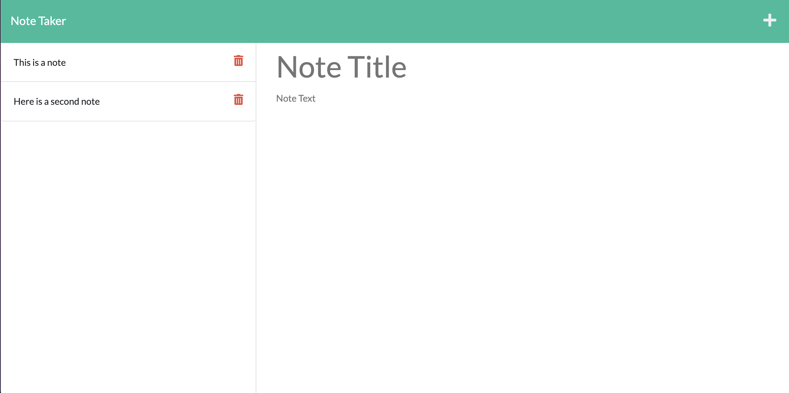

# 11 Express.js: Note Taker

## Description

Create an application called Note Taker that can be used to write and save notes. This application will use an Express.js back end and will save and retrieve note data from a JSON file.

## Table of Contents

- [Screenshot](#screenshot)
- [Installation](#installation)
- [Usage](#usage)
- [Contribute](#contribute)
- [Tests](#tests)
- [Questions](#questions)
- [Links](#links)

## Screenshot

## Installation

Most users will not need to install anything because the application is launched to Heroku. However, should the user want to launch the application locally, they will need to install Express and UUID.

## Usage

Use this application to write, save, and delete notes.

## Contribute

Contact the application owner.

## Tests

If the notes save and delete, the app is working.

## Questions

If you have any questions, please contact:

- Brett Gould
- bgould86@gmail.com
- [https://www.github.com/bgould86](https://www.github.com/bgould86)

## Links

- Here is the repo: [https://github.com/bgould86/note-taker](https://github.com/bgould86/note-taker)
- Here is the live application: [https://www.youtube.com/watch?v=E0dODUwx6Co](https://www.youtube.com/watch?v=E0dODUwx6Co)
